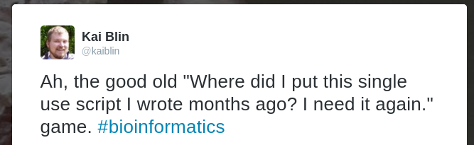

```{r setup, include=FALSE}
knitr::opts_chunk$set(echo = FALSE)
```

## Hej | Who is that guy? {.build}

Scientific Software Engineering

Microbiology

More info:

<div class="columns-2">
- [phdops.kblin.org](https://phdops.kblin.org/)
- [github.com/kblin](https://github.com/kblin/)
- @[kaiblin](https://twitter.com/kblin/)
- [orcid.org/0000-0003-3764-6051](https://orcid.org/0000-0003-3764-6051)

```{r, out.width = 100, fig.retina = NULL}
knitr::include_graphics("graphics/kblin_orchid_qr.png")
```
</div>

## Overview {.build}

- Reproducible Research
- Reproducible Research in Practice
    - Problems

## Overview

- Reproducible Research
- Reproducible Research in Practice
    - Challenges

## Overview

- Reproducible Research
- Reproducible Research in Practice
    - Challenges
- What does actually work (for me)


# Reproducible Research

> There is no such thing as "reproducible science", there is just "science" and "not science". <br>
> -- <cite>Someone on Twitter</cite>

## Reproducibility

Ideally:

- Lab notebook available
- Data on Figshare
- Code on GitHub/Bitbucket (and Figshare)
- Preprint on a preprint server


# Reproducible Research in Practice

> In theory, there is no difference between theory and practice. But, in practice, there is.<br>
> -- <cite>Jan L. A. van de Snepscheut</cite>


## Challenges | Reproducibility isn't free

- Making sure your research is 100% reproducible is a lot of work.
- This takes time and effort. (see [Reproducibility isn't free](https://ropensci.org/blog/2014/06/09/reproducibility/) by FitzJohn *et al.*)
- Even if you are convinced, is your PI / supervisor? Their boss?

## Challenges | Reproducibility isn't compelling

[Nice post](http://software-carpentry.org/blog/2013/02/correctness-isnt-compelling.html) by Greg Wilson in the context of [Software Carpentry](http://software-carpentry.org).

- ~ 5 mio articles published between 1990-2000
- Of these ~ 100 retracted for "computational irreproducibility"
- Chances that your paper is retracted: 1 : 5 000 000
- Assuming ~ 8 months to write paper and 48 hour work week, can spend **115 seconds** on reproducibility

## Challenges | It's not a reflex yet



## But...

Some points [raised by C. Titus Brown](http://ivory.idyll.org/blog/2014-myths-of-computational-reproducibility.html)

- start small
    - provide raw data
    - provide code
    - provide what version of what tool you called with what parameters
- any reproducibility is better than no reproducibility

# What works (for me)

> It works for me.<br>
> -- <cite>Christopher Walken</cite>

## Directory Layout

As regular as possible, at least per project type.

```
2016-04-21_e.xamplis_de_novo/
|-- fastqc/
    |-- post/
    \-- pre/
|-- output/
|-- reads/
|-- scripts/
|-- trimmed/
|-- Makefile
\-- README.md
```

## Directory Layout {.small}

Use a script to create project layout

```bash
#!/bin/bash

mkdir -p reads fastqc/{pre,post} output scripts trimmed
touch README.md Makefile
git init

cat >> .gitignore <<EOF
reads/*gz
fastqc/*
*.swp
EOF

git add .gitignore
git commit -m "Initial commit"
```


## Lab Notebook

- `README.md` file per project
    - Have an explanation what the project is about for future self
    - Then add whatever you're doing to it as it happens
- copy & paste `README.md` into ELN
- Keep in git

## git | all the things! (almost)

- Whenever possible, keep stuff in git
- `README.md`, `Makefile`, scripts, etc.
- Commit when something is changed
- Don't commit reads / generated data

(Maybe use [git-annex](http://git-annex.branchable.com/) for reads)

## git | part deux

- Have some git repo for random stuff unrelated to projects
    - Avoid "where did I put this script?"
- Make small commits of logical units of change
- Write good commit messages

## git commit messages

I suggest the following format:

```
Short summary line < 60 characters

A longer explanation of what the change is about.
This is what your'll read to figure out what this change is about.
Make this count, your future self will thank you.
```

# Questions?

Thanks for your attention.